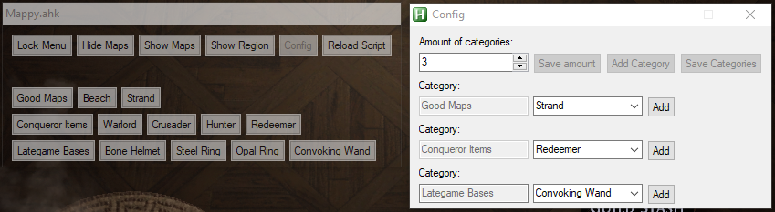
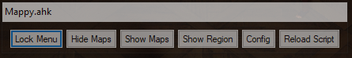
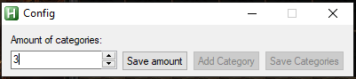
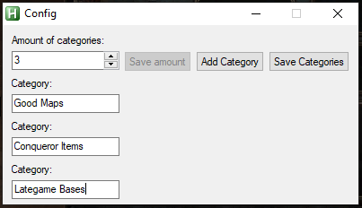
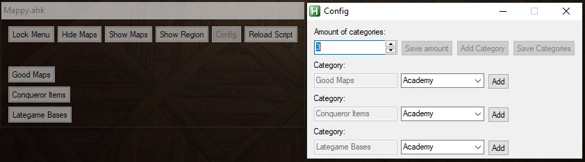
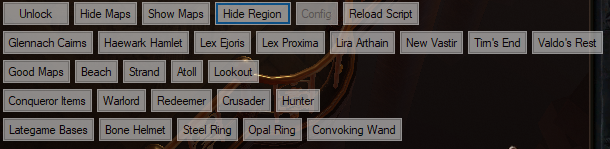

# Mappy

Download here (Choose "Source Code (zip)"): [Mappy](https://github.com/Nekolike/Mappy/releases/tag/v0.7.1-alpha)

Mappy is an ahk (autohotkey) script to ease your inventory searches. It was made with the intend to only search for maps in your stash but after playing around for a while I noticed it also works as a search tool for (almost) everything. (I.e. looking for Bone Helmet or ilvl84 items or Conqueror items etc.)

# Video showcase

I recorded a showcase/tutorial to guide through the tool. You find check it out here: [Youtube - Mappy](https://www.youtube.com/watch?v=JkStW1uJr7A)

# Updates
12.01.2020
- **Mappy v0.7 + 0.7.1 is live now**
- The update is small again and was named 0.6.1 but I messed up and had to rename it to 0.7 (Also added a quick update 0.7.1 for bug-reasons). I added the option to change the overlay-toggle-key to whatever you want! Check out the new "Change Toggle-Key"-button!
- Edit-fields which have no value will now be grayed out to reduce confusion
Bugfix:
- Fixed a bug which would result in ERROR-buttons when canceling the create-process

11.01.2020
- **Mappy v0.6 is live now**
- The update is small but has a lot of value: Auto-updating => The script will now check if a newer version is available online and ask the user if he wants to download it. You won't have to redownload the project in order to get the newest version now. Mappy will do that for you.

10.01.2020
- **Mappy v0.5 is live now**
- You can find details about the update here: [Reddit - Mappy v0.5](https://www.reddit.com/r/pathofexile/comments/empcki/mappy_v05_saving_has_arrived/)
- Recorded a showcase/tutorial to guide through the tool (Can be found in the "How to use Mappy" section)
- Changed "What can Mappy do" and "What can Mappy not do (yet)" due to the new update
- Next priority feature to come: Auto-updating the tool so everyone who will download the new version will always be up to date. This update will be one of the last I'll publicly announce on reddit since I don't want to spam every small update there. I will still write any update status here
- I wish you all a wonderful weekend

# What can Mappy do?

Mappy can:
- Save up to 5 categories for you to put keywords in
- Save all your most used / favourite keywords (I.e. Any lategame base you would search or influence-items, good maps and whatever you are typing in your stash to search for. Setting it up once will create a save-file which then gets reloaded everytime you startup the script so you never have to retype these things again
- Show & Hide keywords. You can either show / hide all keywords in any single category or just show / hide every keyword 
- Show & Hide all 8 region names for you to search in your stash. One click on any region will show all the maps in that region (If you are at your stash with the currently tab containing maps)
- Auto-update itself to get the newest version from github (you will be asked if you want to do that)

# What can Mappy not do (yet)?
This is more a list of things that aren't working / implemented yet. Check out future versions of Mappy to see if any of these were added!

Mappy can't:
- Dynamically add / remove categories & keywords. Once you've set up your environment, it's done and can't be accessed. You can still set up a new overlay to overwrite the previous one.
- Adding information to regions like influence or watch stones. Might be coming in the next couple of updates but it's not on my high-priority list
- Creating / saving multiple overlays which can be loaded individually. This is a feature I would love to implement, will see how I can fit in. 

# How to use Mappy
A video on how to use Mappy can be found in the "Demo Video" section above. I have also written down the needed steps to use and set up your Mappy below:

Step 1: Startup Mappy.ahk - You will see the following window (That will be your main management window)

Step 2: Click on "Config" to set your environment up - A new window will open which looks like this

Step 3: Choose the amount of categories (From 1 to 5) you want to use and save it with the "Save amount"-button (Anything higher will show you a message saying something like "No more than 5!")

(Optional) Step 3.1: Want to add more categories? Click "Add Category" and choose a name (No more than 5 categories!)

Step 4: Your input fields for categories will open below. Choose any name for the category you want.  (I.e. "Good Maps", "Conqueror Items", "Elder/Shaper Items", "Lategame Bases", Gems for new chars)

Step 5: If you are done, click "Save Categories" to lock them in. (They can't be changed in the current version.) New options will pop up next to your categories and the categories will be put into your "Mappy"-Window

Step 6: You can either choose any name for your search-criteria you want or choose a map from the drop-down-list. Inputting the Map name yourself will also work. Any word will work but keep it "searchable" for your map stash, otherwise it will be a useless button. After inputting your word click "Add" to add it to the Mappy-Window.

Step 7: Once you are done with your categories and search-words, close the Config-Window or press "Save Keywords" to save your overlay. The "Mappy"-Window will shortly reload.

Step 8: Choose a place for your Mappy-Window and lock it with the "Lock Menu"-button. (You have to lock it in order for your buttons to work!) You can unlock and move it anywhere else if your place of choice doesn't please you. 

Step 9: Your Mappy is set up and you can start using it. Check out the "What can Mappy do" section to find more additional features.

(Optional) Step 10: Done with searching for items? Hide Mappy with Ctrl+Numpad0

