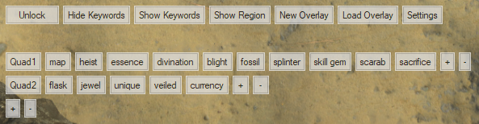

# Mappy

**Download here:** [Mappy](https://github.com/Nekolike/Mappy/releases/tag/v1.04)

Mappy is an ahk (autohotkey) script to ease your inventory searches. It allows you to save all the things you search for in your stash or at vendors every day. It simply replaces typing with clicking on buttons.

# Video showcase

I recorded a showcase/tutorial to guide through the tool. You can check the video out here: [Youtube - Mappy](https://www.youtube.com/watch?v=d_Me_jUMZgk)

# Updates

Check the Changelog.txt for a full list of updates. This place only contains informations about the current progress I'd like to share

**Update 22.09.2020**

Hey guys, first message in a long time. I really enjoy the current league and got my spirit for the game back. While the tool is mostly done for my needs, I will look into the issues again and see if there's anything that needs to be fixed or updated. So let me know if there's something major. Also big big big thanks for Kashi for updating the tool while I wasn't able to and being an amazing person to "work" with. Enjoy the league people!

# What can Mappy do?

Mappy can:
- Save as many categories as you like to put keywords in
- Save all your most used keywords (I.e. Any lategame base you would search or influence-items, good maps and whatever you are typing in your stash to search for) Setting it up once will create a save-file which then gets reloaded everytime you startup the script so you never have to retype these things again)
- Remove any category or keyword you like with right-clicking on the button.
- Remove the last keyword in a category via the "-" button at the end of the category
- Remove the last category via the "-" button at the end of the categories
- Show & Hide keywords. You can either show / hide all keywords in any single category or just show / hide every keyword
- Show & Hide all 8 region names for you to search in your stash. One click on any region will show all the maps in that region (If you are at your stash with the currently tab containing maps)
- Save multiple layouts. You can create a new overlay with the "New Overlay" button and save your overlay as a new one at the end via the "Save As New Overlay". The filename needs to end with ".ini"
- Load any overlay. Click "Load Overlay" and choose a "*.ini" file to load. This works with any .ini that was created via Mappy. Allows for sharing overlays

# How to use Mappy (Version 1.0)

I will update this section with pictures in upcoming days. Sorry for the inconvenience.

Using the overlay is fairly simple. Starting Mappy for the first time will pop up a window with one line of buttons and a "+" button below. (I will call this process Method 1)
- Clicking that + button will add a new category. Categories are like folders, they contain all your keywords. 
- Keywords are the words you'd type in your input field in Path of Exile. 
- Having your first category added allows you to add keywords to that category (Via a "+" button again. The one on the right to your category). With your first category & keyword done, Mappy can go to work. 
- Clicking on your keyword will send the text to Path of Exile (Your stash or vendor menu needs to be open). 
- Repeat this process of adding categories & keywords until you have everything set up. You can now use Mappy everyday instead of typing anything in your stash anymore!
- If you don't need a category or keyword anymore, either hit the "-" button to remove the last item or right-click on a button to remove it

Method 2 (Creating a new overlay via the config-gui. Allows for saving the overlay as a new file)
- Click on "New Overlay" to open a new window which guides you through the process of adding categories & keywords
- Choose the amount of categories you want and same it
- Name your categories and hit "Save Categories"
- You can now add keywords to your categories (The field contains a drop-down-list with all maps if these are what you'd like to add)
- Done with your categories & keywords? You can either choose "Save Overlay" to overwrite your current one or choose "Save As New Overlay" to create a new file (filename must end with ".ini")

Loading Overlays
- You can also load overlays (either from yourself or other people if they share their .ini.)
- Simply select "Load Overlay" and select the file you'd like to load. Done
